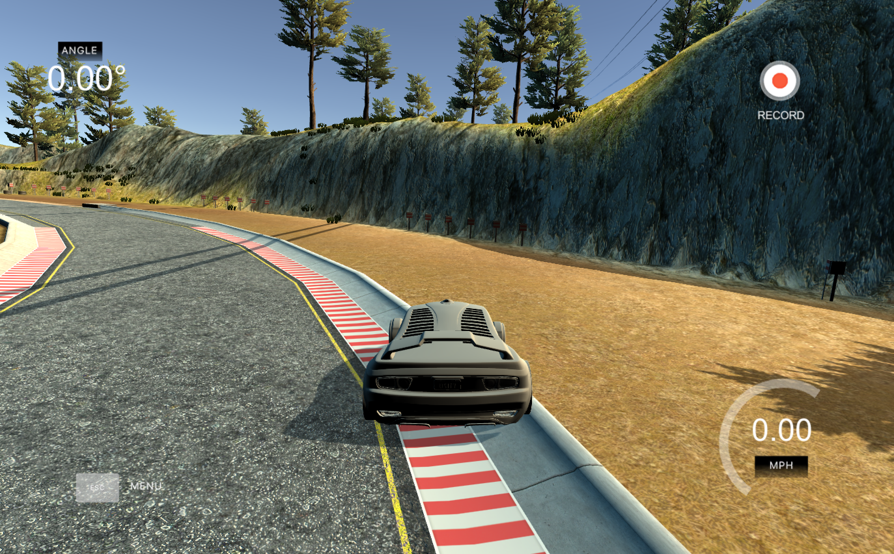

#**Use Deep Learning to Clone Driving Behavior**

---




In this project, a car is trained to drive autonomously in a simulator by taking camera images as inputs to a deep neural network and outputting a predicted steering angle based on these images. For  detailed descriptions of methods, see **writeup_report.md**

### Dependencies

This project requires **Python 3.5** and the following Python libraries installed:

- [Jupyter](http://jupyter.org/)
- [NumPy](http://www.numpy.org/)
- [TensorFlow](http://tensorflow.org)
- [Keras](https://keras.io/)
- [Matplotlib](http://matplotlib.org/)
- [OpenCV](http://opencv.org/)

### Simulator
Provided by Udacity, will be open source soon

### How to run
Using the Udacity provided simulator and my drive.py file, the car can be driven autonomously around the track by executing
```sh
python drive.py model.h5
```

###Result
[](https://youtu.be/ud4JqEngY0Y)

[](https://youtu.be/bPFmJ_luTBU)
