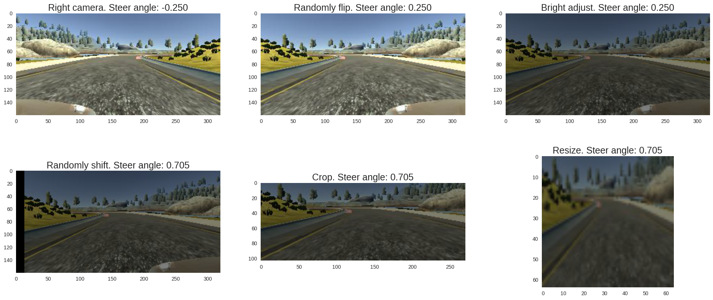

#**Use Deep Learning to Clone Driving Behavior**

---

In this project, a car is trained to drive autonomously in a simulator by taking camera images as inputs to a deep neural network and outputting a predicted steering angle based on these images.

My project includes the following files:
* model.py containing the script to create and train the model
* input.py containing the script to pre-process data and output data generator
* drive.py for driving the car in autonomous mode
* model.h5 containing a trained convolution neural network
* writeup_report.md or writeup_report.pdf summarizing the results

### **Dataset**
For training process, I used dataset provided by Udacity. This data contains 8036 driving logs. Each log records the 3 images from center, left and right camera also the information about steer angle, throttle, break and speed. The driving logs are recorded when the car drove in the first track. The problem to predict the steer angle from camera image to let the car autonomously drive not only in the first track but also in the test second track. The throttle and break will automatically adjusted by the simulation.  

Steer angles, throttles, breaks, speeds in the dataset.

The steer angle data is unbalance, since most of the time the car went straight.

### **Data pre-processing and augmentation**
Beside center camera, left and right camera images are also used for training. By adding a small angle (0.25) to the left camera and subtracting a small angle (0.25) from the right camera, the car is forced to recover if it wanders off the side.

Data pre-processing and augmentation

* From each driving log randomly choose image from center, left or right camera
* Randomly flip the image horizontally
* Randomly adjust the brightness of the image
* Randomly shift the image horizontally and compensate the steer angle 0.035 by pixel.
* Crop the image to remove the redundant information
* Reshape image to 64x64

After preprocessing the steer distribution of the data becomes

### Model architecture

* The data is also normalized in the model using Keras lambda layer.
* Adam optimizer was adopted with learning rate `5e-4` and default setting from Keras.

### Training strategy
#####1. Use `fit_generator` function to prevent memory overflow:
Image preprocessing is done in the function `input.train_batch_generator()` whose output is a generator. The data then will be augmented on-the-fly. New data are constantly generate along to training process. This will prevent the memory overflow problem and avoid to save a lot of data on hard disk.

#####2 Prevent overfitting
* I used 20% of dataset to validate and choose the model at the point where the valuation loss stared increasing.

 * The model also contains several dropout layers and a L2 regularization for the dense layer to reduce overfitting.

###Result

